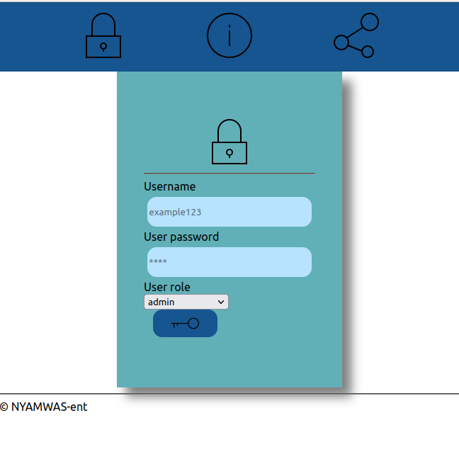
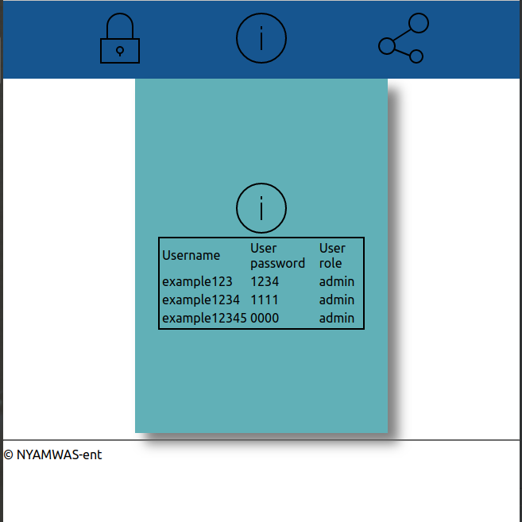
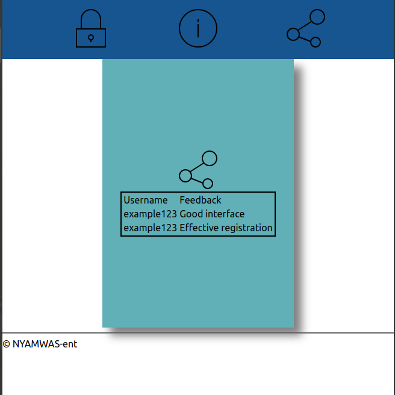

# project-app
## Goals
<ul>
    <li>To offer financial services to end users like deposit, loan, and withdraw</li>
    <li>To offer financial information to new users such as pension schemes, stock shares and account details</li>
</ul>

## Target Audience
<ol>
    <li> Administrator</li>
    <li> Client</li>
    <li> Maintenance</li>
</ol>

## Site Map

<table>
    <tr>
        <td>HOME</td>
        <td>An interface that displays links to other pages</td>
    </tr>
    <tr>
        <td>ABOUT</td>  
        <td>An interface that shows company goals, mission statement and target audience</td>
    </tr>
    <tr>
        <td>FEEDBACK</td>
        <td>An interface that allows users to submit reponses about the services offered</td>
    </tr>
</table>

## Design Themes
<table>
    <tr>
        <td>Frontend design</td>
        <td>react js</td>
    </tr>
    <tr>
        <td>Backend design</td>
        <td><ul><li>node js</li><li>express js</li></ul></td>
    </tr>
</table>

## Rough Sketches of each page
<table>
    <tr>
        <td>Home</td>
        <td></td>
    </tr>
    <tr>
        <td>
            About
        </td>
        <td></td>
    </tr>
    <tr>
    <td>
        Feedback
    </td>
    <td></td>
    </tr>
</table>